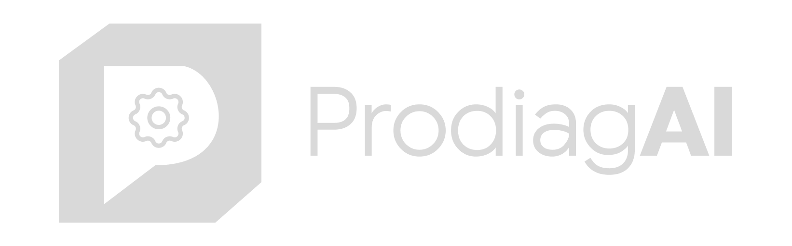
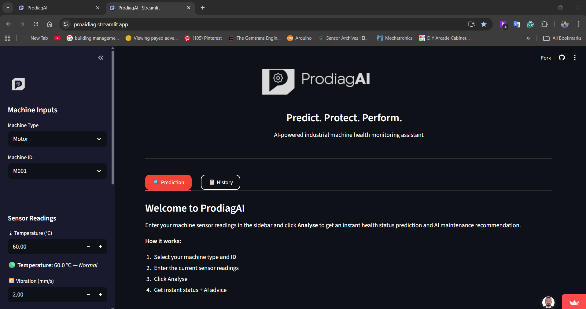
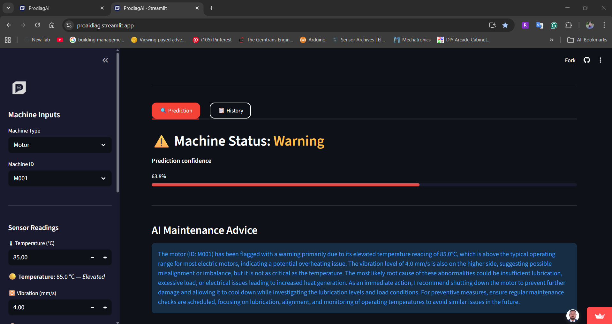
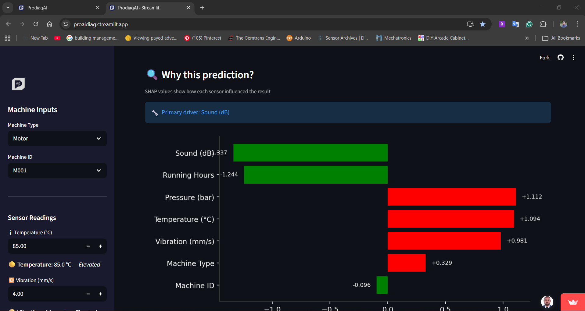

# 🔧 ProdiagAI — AI-Based Predictive Maintenance Assistant

<div align="center">



### Predict. Protect. Perform.

**AI-powered industrial machine health monitoring assistant**

[](https://proaidiag.streamlit.app)
[](https://python.org)
[](https://streamlit.io)
[](https://xgboost.readthedocs.io)
[](https://openai.com)

---

> Built for the **DDS Academy AI Application Building Challenge 2026**
> 
> 🏆 8-day challenge | Model accuracy: **99.89%** | Live deployed

</div>

---

## 📸 Screenshots

<!-- Replace with your actual screenshots -->
| Welcome Screen | Prediction Result | SHAP Explainability |
|:---:|:---:|:---:|
|  |  |  |
| *Sensor inputs & gauges* | *Status badge & AI advice* | *Feature contribution chart* |

> 📌 **[→ Try the live app here](https://proaidiag.streamlit.app)**

---

## 🎯 What is ProdiagAI?

ProdiagAI predicts the health status of industrial rotating machinery — **motors, pumps, compressors, fans, and conveyors** — using 5 real-time sensor inputs and delivers an instant AI-generated maintenance recommendation.

### The Problem
Industrial machine failures cost manufacturing operations millions in unplanned downtime, emergency maintenance, and safety incidents. Traditional maintenance is **reactive** — machines are repaired after they break.

### The Solution
ProdiagAI shifts maintenance from reactive to **predictive**. Enter sensor readings → get instant health status → understand *why* → get AI advice on *what to do*.

---

## ✨ Key Features

| Feature | Description |
|---|---|
| 🤖 **ML Health Prediction** | XGBoost classifier — 99.89% accuracy, 3-class output (Normal / Warning / Fault) |
| 🧠 **SHAP Explainability** | See exactly which sensor caused the prediction — not a black box |
| 💬 **AI Maintenance Advice** | GPT-4o-mini generates structured, engineer-grade maintenance recommendations |
| 🟢🟡🔴 **Sensor Gauges** | Real-time colour indicators showing Normal / Elevated / Critical per sensor |
| 📊 **Confidence Score** | Prediction confidence percentage with visual progress bar |
| 📋 **Prediction History** | Filterable history table with CSV export — persists across browser refresh |
| 🔒 **Input Validation** | Rejects out-of-range sensor values before calling any API |
| ⚡ **Cached Models** | `@st.cache_resource` — models load once, instant predictions |

---

## 🏗️ System Architecture

```
User Input (5 sensors + machine type/ID)
        ↓
Streamlit UI (app.py)
        ↓
XGBoost Classifier → Prediction + Confidence
        ↓                      ↓
SHAP Explainer          OpenAI GPT-4o-mini
        ↓                      ↓
Feature Chart          Maintenance Advice
        ↓                      ↓
        └──────── Results UI ──────────┘
                       ↓
              Prediction History Log
```

---

## 📊 Model Performance

| Model | Accuracy | F1 Weighted | F1 Fault | F1 Warning |
|---|---|---|---|---|
| **XGBoost** ✅ | **0.9989** | **0.9989** | **0.9972** | **0.9972** |
| Random Forest | 0.9997 | 0.9997 | 1.0000 | 0.9993 |
| Logistic Regression | 0.9994 | 0.9994 | 0.9972 | 0.9986 |

> XGBoost selected as final model — industry standard for tabular sensor data, faster inference, superior real-world noise robustness, native SHAP support.

---

## 🛠️ Tech Stack

```
Frontend:     Streamlit 1.56.0
ML Model:     XGBoost 2.0.3 + scikit-learn 1.5.0
Explainability: SHAP 0.45.1
LLM:          OpenAI GPT-4o-mini
Data:         pandas 2.2.2 + numpy 1.26.4
Imbalance:    imbalanced-learn (SMOTE)
Visualisation: matplotlib + seaborn
Security:     python-dotenv (.env secrets)
Deployment:   Streamlit Community Cloud
```

---

## 🚀 Quick Start

### 1. Clone the repository
```bash
git clone https://github.com/NipunKavinda95/ProdiagAI
cd ProdiagAI
```

### 2. Create virtual environment
```bash
python -m venv venv

# Windows
venv\Scripts\activate

# Mac / Linux
source venv/bin/activate
```

### 3. Install dependencies
```bash
pip install -r requirements.txt
```

### 4. Set up API key
Create a `.env` file in the project root:
```
OPENAI_API_KEY=your_openai_api_key_here
```

### 5. Run the app
```bash
streamlit run app.py
```

Open your browser at `http://localhost:8501`

---

## 📁 Project Structure

```
ProdiagAI/
├── app.py                      → Streamlit UI — main entry point
├── src/
│   ├── model.py                → XGBoost prediction with caching
│   └── assistant.py            → OpenAI LLM integration + retry logic
├── models/
│   ├── xgb_model.pkl           → Trained XGBoost classifier
│   ├── scaler.pkl              → StandardScaler
│   ├── label_enc.pkl           → Status label encoder
│   ├── type_enc.pkl            → Machine type encoder
│   └── id_enc.pkl              → Machine ID encoder
├── notebooks/
│   ├── 01_train_model.ipynb    → ML training + 3-model comparison
│   └── 02_llm_evaluation.ipynb → LLM prompt comparison + faithfulness
├── data/
│   └── data.csv                → 12,000 row synthetic sensor dataset
├── reports/
│   ├── model_comparison.png    → 3-model comparison chart
│   ├── confusion_matrices_all.png
│   ├── shap_summary.png
│   └── eda_sensor_distributions.png
├── assets/
│   ├── prodiagai_logo.png      → Full logo
│   └── prodiagai_icon.png      → Favicon / sidebar icon
├── .streamlit/
│   └── config.toml             → Dark theme configuration
├── .env                        → API keys (NOT committed)
├── .gitignore
├── requirements.txt
└── README.md
```

---

## 📈 Dataset

| Property | Detail |
|---|---|
| Total records | 12,000 rows |
| Features | Temperature (°C), Vibration (mm/s), Running Hours, Pressure (bar), Sound (dB), Machine Type, Machine ID |
| Classes | Normal (70%), Warning (20%), Fault (10%) |
| Machine types | Motor, Pump, Compressor, Fan, Conveyor |
| Machine IDs | M001 – M020 |
| Type | Synthetic — generated with realistic industrial sensor distributions |
| Imbalance fix | SMOTE applied on training split only |

---

## 🔬 LLM Evaluation

| Prompt Version | Latency | Quality |
|---|---|---|
| P01 Baseline | 8.68s | Generic, missed sensors |
| P02 Role + Context | 3.98s | Good, partial analysis |
| **P03 Chain of Thought** ✅ | **2.95s** | **Best — specific thresholds, all sensors, clear action** |

**Model comparison:** GPT-4o-mini selected over GPT-3.5-turbo — better quality ($0.00020/call vs $0.00051/call) and 2.95s average latency.

---

## 👤 Author

**D.I.G. Nipun Kavinda**
Mechanical & AI Automation Engineer

- 8+ years experience in Mechanical & Automation Engineering, Maintenance Engineering and Industrial AI
- Reduced machine downtime by 28% and manual effort by 50% through ML and automation deployments
- Expertise: Automation · Mechanical Engineering · Python · LLM · Data Analytics · RPA · CAD/CAM · Machine Learning

[](https://linkedin.com/in/your-profile)
[](https://github.com/NipunKavinda95)

---

## 🎓 Challenge

Built as part of the **[DDS Academy AI Application Building Challenge 2026](https://linkedin.com/company/decodingdatascience)**

> 8-day sprint: ideation → dataset → ML model → LLM integration → UI → deployment

---

## 📄 License

This project was developed for the DDS Academy challenge. All rights reserved.

---

<div align="center">

**⭐ If you found this useful, give it a star!**

[🚀 Live App](https://proaidiag.streamlit.app) · [📧 Contact](mailto:Nipun.mecheng@gmail.com) · [💼 LinkedIn](https://www.linkedin.com/in/nipun-kavinda/)

</div>
